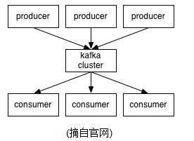
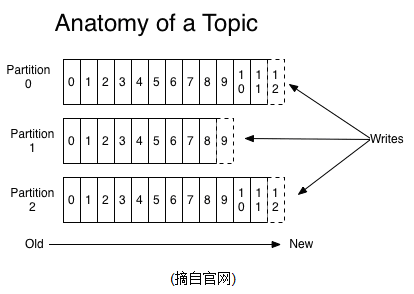

## Kafka集群安装和安全加固说明
### 一、Kafka 组件介绍 
Kafka是一个高可靠的分布式消息队列，如下图所示，其主要包含如下角色：    
    
1)producer: 消息的生产者，生产者将消息发布到kafka的集群中；        
2)consumer:消息的消费者，消费者可以到kafka集群中订阅消息，消费kafka集群中的消息；    
3)broker:kafka集群中的服务器节点，用来存储消息；    
kafka最核心的概念，就是它的topics(logs).producer往kafka集群上存放消息或者consumer往kafka集群消费消息是，都是以topic的维度进行。一个Topic可以认为是一类消息，每个topic将被分成多个partition(区)存储，在server端,每个partition在存储层面是append log文件。任何发布到此partition的消息都会被直接追加到log文件的尾部，每条消息在文件中的位置称为offset（偏移量），offset为一个long型数字，它是唯一标记一条消息。它唯一的标记一条消息。kafka并没有提供其他额外的索引机制来存储offset，因为在kafka中几乎不允许对消息进行“随机读写”。


     
日志文件将会根据broker中的配置要求,保留一定的时间之后删除;比如log文件保留2天,那么两天后,文件会被清除,无论其中的消息是否被消费.kafka通过这种简单的手段,来释放磁盘空间,以及减少消息消费之后对文件内容改动的磁盘IO开支.    
topic两个最核心的特性就是多parition和多replication。    
1)partition的设计目的:    
a)最根本原因是kafka基于文件存储.通过分区,可以将日志内容分散到多个server上,来避免文件尺寸达到单机磁盘的上限,每个partiton都会被当前server(kafka实例)保存;        
b)此外越多的partitions意味着producer可以启多并发来生产数据，consumer可以启多并发来消费数据，有效提升消息生产和消费的效率；    
2)多replication指log在存储时，可以按多副本存储，提升高可用性。    
a)基于replicated方案,那么就意味着需要对多个备份进行调度;每个partition都有一个server为"leader";leader负责所有的读写操作,如果leader失效,那么将会有其他follower来接管(成为新的leader);follower只是单调的和leader跟进,同步消息即可.由此可见作为leader的server承载了全部的请求压力,因此从集群的整体考虑,有多少个partitions就意味着有多少个"leader",kafka会将"leader"均衡的分散在每个实例上,来确保整体的性能稳定.        
3)Producer将消息发布到指定的Topic中,同时Producer也能决定将此消息归属于哪个partition;比如基于"round-robin"方式或者通过其他的一些算法等.    
4)每个consumer属于一个consumer group;反过来说,每个group中可以有多个consumer.发送到Topic的消息,只会被订阅此Topic的每个group中的一个consumer消费.kafka只能保证一个partition中的消息被某个consumer消费时,消息是顺序的.事实上,从Topic角度来说,消息仍不是有序的.        

### 二、kafka集群安装和配置    
由于当前我们使用flink 1.3.0版本，该版本只支持kafka 0.10.x的版本，因此，我们安装的kafka为0.10.0.1版本，具体的安装步骤如下:        
1、由于kafka集群中依赖于zookeeper，因此在安装kafka前，先安装zookeeper集群;        
2、下载kafka二进制压缩包kafka_2.11-0.10.0.1.tgz，并解压；        
3、当前用两个节点做集群，分别在那个节点的conf文件夹的server.properties文件中，配置如下配置项：      
节点0的配置：    
```xml
broker.id=0
log.dirs=/home/hadoop/data/kafka/logs
zookeeper.connect=zjdex07:2181,zjdex08:2181,zjdex09:2181
zookeeper.connection.timeout.ms=6000
auto.create.topics.enable=true
listeners=PLAINTEXT://zjdex07:9102
default.replication.factor=2
offsets.topic.replication.factor=2
```
节点1的配置如下：        
```xml
broker.id=1
log.dirs=/home/hadoop/data/kafka/logs
zookeeper.connect=zjdex07:2181,zjdex08:2181,zjdex09:2181
zookeeper.connection.timeout.ms=6000
auto.create.topics.enable=true
listeners=PLAINTEXT://zjdex08:9102
default.replication.factor=2
offsets.topic.replication.factor=2
```
3、使用nohup bin/kafka-server-start.sh config/server.properties &命令分别在两个节点下启动； 至此，两个节点的kafka集群安装完毕；        

4、可以用如下命令，模拟producer和consumer进行消息发布和消息消费功能测试：    
```xml
启动producer：
./bin/kafka-console-producer.sh --producer.config /home/hadoop/software/kafka_2.11-0.10.0.1/config/producer.properties --broker-list 192.168.0.250:9102,192.168.0.165:9102 --topic jdbcdata
```
```xml
启动consumer： 
./bin/kafka-console-consumer.sh --consumer.config /home/hadoop/software/kafka_2.11-0.10.0.1/config/consumer.properties --zookeeper zjdex07:2181 --topic jdbcdata --from-beginning
或
./bin/kafka-console-consumer.sh --new-consumer --consumer.config /home/hadoop/software/kafka_2.11-0.10.0.1/config/consumer.properties --bootstrap-server 192.168.0.250:9102,192.168.0.165:9102 --topic jdbcdata --from-beginning    
```
注意：在跑producer或consumer命令时，可以在config下面tools-log4j.properties中修改日志级别；    

### 三、kafka安全加固
1、使用SSL加密传输，需要在server.properties中增加如下配置项:        
```xml
security.protocol=SSL
ssl.protocol=TLS
ssl.enabled.protocols=TLSv1.2,TLSv1.1,TLSv1
security.inter.broker.protocol=PLAINTEXT
listeners=SSL://192.168.0.250:9102,PLAINTEXT://192.168.0.250:9101
ssl.keystore.location=/home/hadoop/authplatform/certification/server/keystore.jks
ssl.truststore.location=/home/hadoop/authplatform/certification/server/truststore.jks
ssl.keystore.password=KZEKcjxzZoTRgSP9ItHC1g\=\=
ssl.truststore.password=KZEKcjxzZoTRgSP9ItHC1g\=\=
ssl.key.password=KZEKcjxzZoTRgSP9ItHC1g\=\=
```
注意：

1）对于listerners中配置两条链路的(对外提供服务的链路、对内broker之间的链路)不要配置advertised.host.name配置项，该配置项配置后，会以该配置项优先，会导致只启动一个链路。查看server日志，Registered broker 0 at path /brokers/ids/0 with addresses: SSL -> EndPoint(zjdex07,9102,SSL),PLAINTEXT -> EndPoint(zjdex07,9101,PLAINTEXT) (kafka.utils.ZkUtils)，两条链路都建立后，才认为启动成功；

2）对于broker集群场景，在没有配置advertised.host.name的情况下，默认会以listener中配置的IP往ZK节点上注册，因此在listener中不要配置全网监听；

2、采用SASL进行认证：    
采用acl的机制，对访问kafka的用户做认证和权限控制。    
1)修改kafka bin中的如下脚步：    
a)在kafka-run-class.sh（该脚本在kafka-server-start.sh中调用）脚本中增加kafka server端的环境变量设置，增加-Djava.security.auth.login.config=/home/hadoop/authplatform/conf/saslconf.jaas.server；    
b)修改kafka acl设置脚本kafka-acls.sh，在该脚本中修改，将执行kafka-run-class.sh改为执行kafka-acl-class.sh.并同时新增kafka-acl-class.sh，该脚本的内容和源生态的kafka-run-class.sh一致；    
2)在borker的配置文件server.properties中增加如下配置项:     

```xml
security.protocol=SASL_SSL
allow.everyone.if.no.acl.found=false
super.users=User:admin;User:kafka;User:QGU4bNZc
listeners=SASL_SSL://192.168.0.250:9102,PLAINTEXT://192.168.0.250:9101
sasl.mechanism.inter.broker.protocol=PLAIN
authorizer.class.name=kafka.security.auth.SimpleAclAuthorizersasl.enable
sasl.enabled.mechanisms=PLAIN
```   


